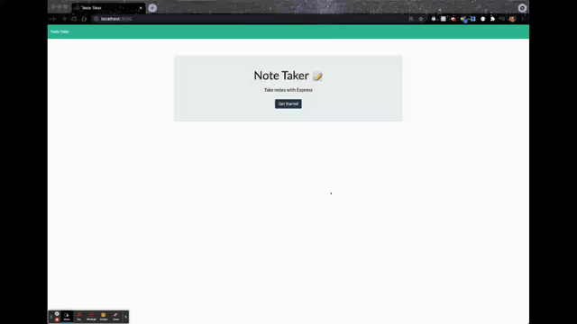

# Note-Taker

## Description 

* This is an application that allows users to write, save, update and delete notes. The user can keep track of to-do lists, grocery items, etc. by utilizing this 
note taking app. 

## Table of Contents

* [User Story](#userstory)
* [Installation](#installation)
* [Preview](#preview)
* [Deployed Link](#deployedlink)
* [Questions](#questions)

## User Story
AS A small business owner
I WANT to be able to write and save notes
SO THAT I can organize my thoughts and keep track of tasks I need to complete

## Installation
* The user can clone the repo to their local repo. Make sure to have Node/Express.js installed. Install the necessary dependencies by using your CLI and run:
```
npm i
```
* To run the application, invoke the following command:
```
node server.js
```
* Open up your default browser and navigate to `http://localhost:3000` to run the application on your local machine.

## Preview

* 

## Deployed Link

* Feel free to check out the live application hosted on Heroku [here]().

## Questions

* If you have any questions, please feel free to contact me @ tyler.hance@gmail.com or visit my repo for additional projects @ https://github.com/tylerhance.